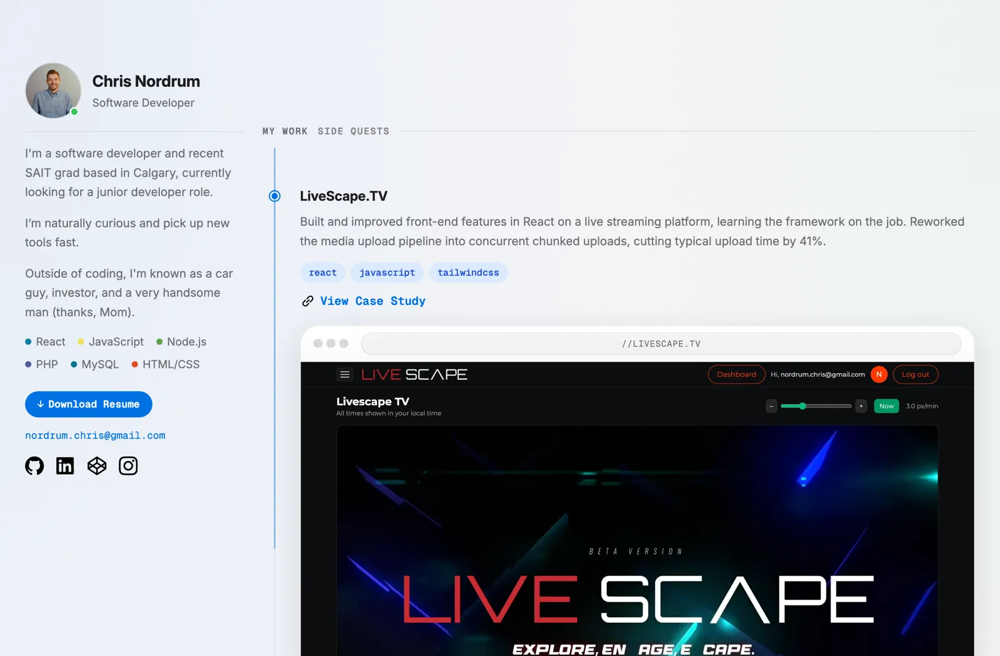

# chris-portfolio

My portfolio site. Live at **[chrisnordrum.com](https://chrisnordrum.com)**.



## The idea

I wanted the site to feel like GitHub, since that's where developers already spend half their day.

So the homepage is laid out like a **GitHub profile** — photo and bio in the sidebar, my stack listed out with the little colored language dots, and an activity feed of what I've been working on (with tabs for My Work and Side Quests).

Click into a project, and it opens as a **case study dressed up like a repo**: a `chrisnordrum / livescape-tv` breadcrumb up top, the write-up sitting under a `CASESTUDY.md` header like you're reading a repo's readme, and a sidebar with the languages, contributors, and links.

## How it's built

No framework, no build step, nothing to `npm install`. Just HTML, CSS, and a bit of vanilla JavaScript.

## Details I'm happy with

- Light and dark themes that follow your system, done with CSS variables
- A timeline down the side that fills in as you scroll past each project
- `script.js` handles all of it — the timeline, the tabs, and the before/after slider in the Wild Rose case study

## Accessibility

I built it to work without a mouse, or without seeing it at all. The markup is semantic with a proper heading order, so a screen reader can move through the page by structure. The tabs are real buttons with visible focus rings, images have alt text, and the before/after slider is labeled. It also respects `prefers-reduced-motion` — turn animations off and the timeline and fades hold still.

## Performance

Fonts are self-hosted and preloaded, so there's no round-trip to Google and no flash of invisible text while the page loads. Images are all `webp` with their dimensions set up front, which stops the layout from jumping around as they come in, and anything below the fold waits until you scroll to it. There are no third-party requests at all — every byte comes from the site itself.

## The files

```
index.html      the profile / homepage
livescape.html  ┐
dorc.html       ├ case studies
wildrose.html   ┘
styles.css      everything visual, both themes
script.js       timeline, tabs, comparison slider
```


